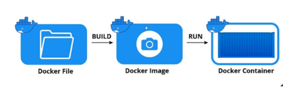

# Containerize First a JavaScript Application

This project demonstrates how to containerize a simple Node.js application using Docker.

## 1.Clone the project

git clone https://github.com/RavinduRasara/Docker-first-nodeapp-1.git

## 2.install nodejs,npm and docker

run the project 

$ node -v                                                                                                     
$ npm -v                                                                                                      
$ node index.js                                                                                             
                                                                                                 

  
                                         

1.Builds a Docker image from the Dockerfile   
$docker build -t my-first-image . 

2.lists all Docker images available on your system   
$docker images 

3.Runs docker image.   
$docker run my-first-image

4.Runs a container from  image and assigns it a name
$docker run --name my-first-container my-first-image

5.lists all running containers
$docker ps  

6.lists all containers, including stopped ones.
$docker ps -a                                                                             